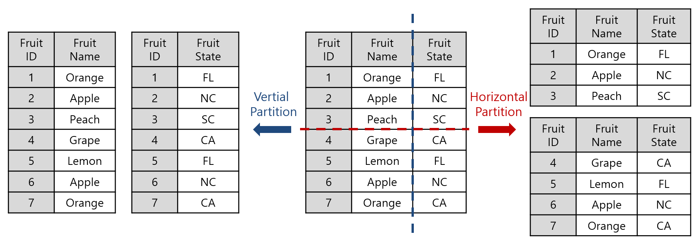
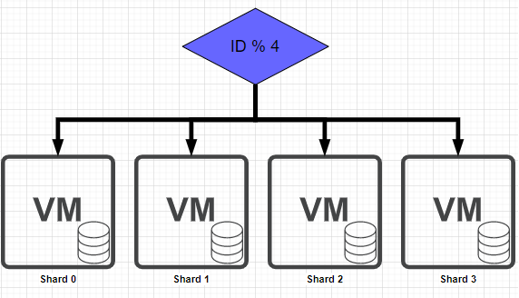
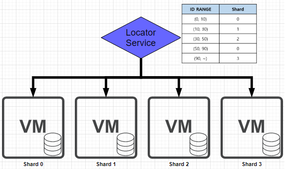
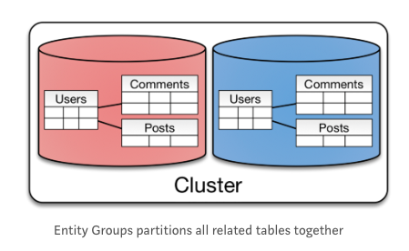

# DB클러스터링

데이터베이스 서버를 여러 개 두는 것

  

- 한개의 DB 서버로 서버 장애시 서비스 전체 중단됨

## Active & Active Clustering

여러개의 DB 서버 전체를 active상태로 두는것

  

- 서버 한 대가 죽어도 다른 서버가 동작하고 있어서 서비스에 문제가 발생하지 않음
- 서버 스케일 아웃이 가능함 -> CPU와 메모리 이용률을 올릴 수 있음
- 서버를 여러대 한꺼번에 운영하므로 비용이 더 발생

### storage 동기화 방법

클러스터링은 동기 방식으로 노드들 간의 데이터를 동기화가 필수

1. 무공유(Shared Nothing) 클러스터

   - 각 노드는 자신이 관리하는 데이터 파일을 자신의 로컬 디스크에 저장하며, 노드 간에 공유하지 않음
   - 각 노드는 완전히 분리된 데이터의 소유권을 가지고 있으며, 데이터의 소유권을 자기는 서버가 처리함.
   - 요청을 받으면 처리할 데이터를 갖고 있는 노드에게 신호를 보내 데이터 처리를 요청함
   - 동기화 시간으로 인하여 쓰기성능 저하

2. 공유 디스크(Shared Disk) 클러스터

   - 데이터 파일은 논리적으로 모든 데이터베이스이 공유하여 모든 데이터에 접근할 가능함.
   - 데이터를 공유하려면 SAN(Storage Area Network)과 같은 공유 디스크가 필수.
   - 여러 노드가 데이터를 수정할 수 있기 때문에 노드간의 동기화 작업 수행을 위한 별도의 커뮤니케이션 채널이 필요.
   - 클러스터를 구성하는 노드 중 하나의 노드만 살아 있어도 서비스가 가능
   - 클러스터가 커지면 디스크 영역에서 병목현상 발생

## Active & Standby Clustering

여러개의 DB 서버중 일부를 active상태로 두는것

  

- Active 서버 하나만 운영하고 나머지 서버는 Standby 상태로 두었다가, Active 서버가 장애시에 Standby 서버를 Active로 전환
- Stanby 서버를 Active 서버로 전환하는(Fail over) 시간 동안 서비스가 중단됨.
- 한대만 운영하기 때문에 효율은 Active & Active의 1/2 정도.
- 공유 디스크 사용시 한 대로 서버만 디스크에 접근하여 병목현상이 없음

# 리플리케이션

데이터베이스 서버와 스토리지 전체를 여러 개 두는 것

  

- 여거래의 서버를 Master와 Slave로 구분하여 구성.
- DB 요청의 60~80% 정도가 읽기 작업인 것을 이용하여 읽기 작업을 Slave 서버로 분산처리하여 성능 향상.
- 비동기 방식으로 운영되어 지연 시간이 거의 없다.
- Master에서 Slave로 비동기 방식으로 데이터를 동기화 하기 때문에 일관성있는 데이터를 얻지 못할 수 있음.
  - 동기방식으로 Replication을 할 수 있지만 이럴 경우 속도가 느려짐

### 비동기 방식 처리 순서

1. Master 노드에 쓰기 트랜잭션이 수행된다.
2. Master 노드는 데이터를 저장하고 트랜잭션에 대한 로그를 파일에 기록한다.(BIN LOG)
3. Slave 노드의 IO Thread는 Master 노드의 로그 파일(BIN LOG)를 파일(Replay Log)에 복사한다.
4. Slave 노드의 SQL Thread는 파일(Replay Log)를 한 줄씩 읽으며 데이터를 저장한다.

# 파티셔닝과 샤딩

- 테이블에 데이터가 많은 경우 Slave DB서버를 늘리더라도 데이터를 찾는데 많은 시간이 소요됨.
- 테이블을 특정 기준으로 나눠서 저장 및 검색.
  

- 샤딩(Horizontal partitioning): 하나의 테이블의 각 행을 다른 테이블에 분할.
- 파티셔닝(Vertical partitioning): 테이블의 일부 열을 빼내는 형태로 분할.

## 샤딩

- 샤딩의 핵심은 Data를 어떻게 잘 분산 시켜 저장할 것인지, 그리고 어떻게 잘 읽을 것인지에 대한 결정 입니다
- 어떻게 잘 분산 시켜 저장할지에 기준이 되는 것이 Shard Key

### 샤딩 분할 방법

#### Hash Sharding

- 샤드의 수 만큼 Hash 함수를 사용 해서 나온 결과에 따라 DB 서버에 저장하는 방식
- 구현이 간단하지만 확장성이 낮음, DB 서버가 추가 될 경우 해쉬 함수가 변경되어야 하므로 기존에 저장되던 데이터의 정합성이 깨짐.

  

#### Dynamic Sharding

- 테이블 형식의 데이터를 바탕으로 샤드를 결정해서 적절히 저장 하는 방식.
- 해쉬 샤딩과 달리 단순히 키만 추가해주면 되므로 확장이 쉬움.
- 서비스가 단일 장애점이 됨, 서비스에 장애가 발생하면 나머지 샤드 또한 문제가 발생.

  

#### Entity Group

- 연관성이 있는 엔티티를 한 샤드에 두는 방식 NoSQL보다 RDB와 잘 어울리는 방식.
- 같은 샤드에 있는 데이터를 조회할 때는 효과적이지만, 다른 샤드에 있는 데이터를 함께 조회할 때는 오히려 성능이 떨어짐.

  

### 그외

- moduler sharding: PK를 모듈러 연산한 결과로 DB를 특정하는 방식
  - 데이터량이 일정 수준에서 유지될 것으로 예상되는 데이터 성격을 가진 곳에 적용할 때 좋음.
  - DB를 추가 증설해야하는 상황에서 이미 적재된 데이터의 재정렬이 필요.
- range sharding: PK의 범위를 기준으로 DB를 특정하는 방식.
  - 활성유저가 몰린 DB로 트래픽이나 데이터량이 몰릴 수 있음.

### 샤딩의 한계

- 두 개 이상의 샤드에 대한 JOIN 연산불가.
- auto increment 등은 샤드 별로 달라질 수 있음.
- last_insert_id() 값은 유효하지 않음.
- 하나의 트랜잭션에서 두 개 이상의 샤드에 접근할 불가.

## 파티셔닝

- 사용이 적은 열이나 자릿수가 많은 열을 분할하여 성능을 향상.
- 관계형 DB에서 3정규화된 데이터를 분리하는 과정
  - 하나의 테이블(엔티티)의 컬럼을 기준으로 분리하는 작업.
- 큰 테이블을 제거하여 관리에 용이함
- 대용량 Data Write환경에서 효율적
- 테이블 간 JOIN비용 추가됨
- 테이블과 인덱스를 별도로 파티셔닝 할 수 없고 함께 파티셔닝 해야함.

## QnA

## References

> https://tecoble.techcourse.co.kr/post/2021-09-18-replication_clustering/
>
> https://dheldh77.tistory.com/entry/%EB%8D%B0%EC%9D%B4%ED%84%B0%EB%B2%A0%EC%9D%B4%EC%8A%A4-%ED%81%B4%EB%9F%AC%EC%8A%A4%ED%84%B0%EB%A7%81Clustering
>
> https://velog.io/@gkskaks1004/%ED%81%B4%EB%9F%AC%EC%8A%A4%ED%84%B0%EB%A7%81-vs-%EB%A6%AC%ED%94%8C%EB%A6%AC%EC%BC%80%EC%9D%B4%EC%85%98-vs-%EC%83%A4%EB%94%A9
>
> https://velog.io/@hyelimchoi1223/ADP-%EB%8D%B0%EC%9D%B4%ED%84%B0%EB%B2%A0%EC%9D%B4%EC%8A%A4-%ED%81%B4%EB%9F%AC%EC%8A%A4%ED%84%B0
>
> https://jordy-torvalds.tistory.com/94
>
> https://velog.io/@yangsijun528/%ED%8C%8C%ED%8B%B0%EC%85%94%EB%8B%9D%EA%B3%BC-%EC%83%A4%EB%94%A9
>
> https://seokbeomkim.github.io/posts/partition-and-sharding/
>
> https://moonsbeen.tistory.com/27
>
> https://gmlwjd9405.github.io/2018/09/24/db-partitioning.html
