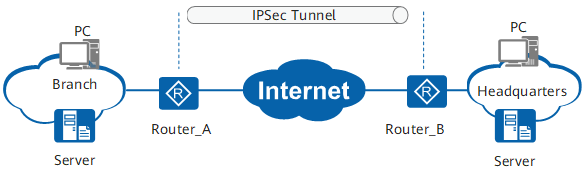
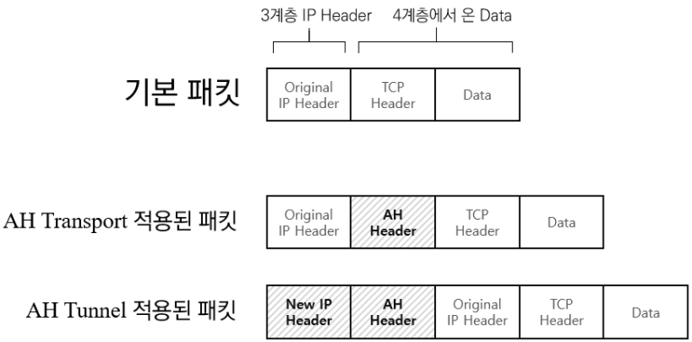
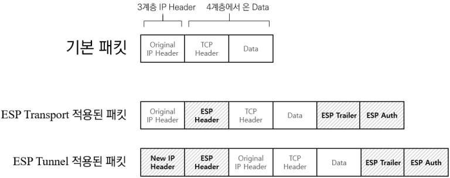
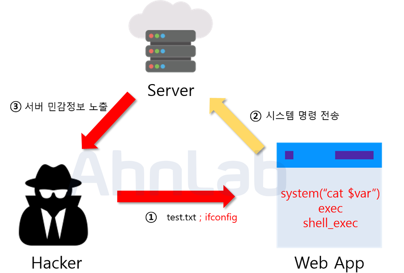
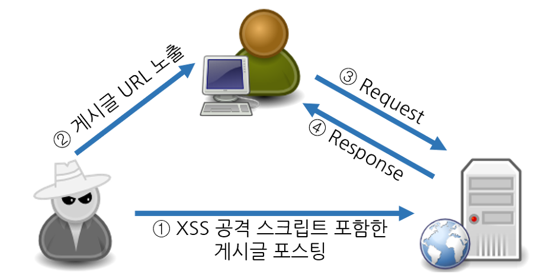
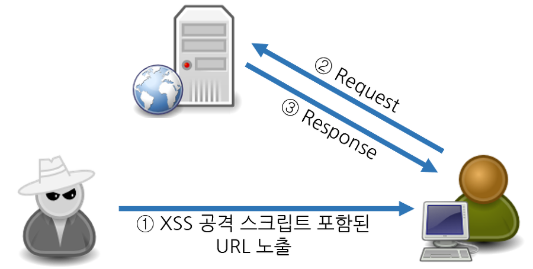

# 네트워크 보안(Network Security)

## 보안의 3대 요소

1. 기밀성
   - 인가되지 않은 사용자가 정보의 `내용을 알 수` 없도록 하는 것
   - 스니핑(sniffing): 네트워크 패킷을 도청하는 공격
2. 무결성
   - 인가된 자에 의해서만 `변경` 가능한 것
   - 스푸핑(spoofing): 네트워크 패킷의 정보를 변조하는 공격
3. 가용성
   - 인가된 자에게 정보에 `사용이` 확실하게 보장되는 것
   - Dos(Denial of Service): 공격 대상의 자원을 소비시켜 서비스를 마비시키는 공격

## IPSec(Internet Protocol Security)

- IP계층(네트워크 계층)에서 IP 패킷 암호로 보호함
- 전송계층(Transport)의 개념인 TCP와 UDP를 모두 보호할 수 있음
- IPsec은 VPN에서 사용되고 있다.

* VPN(Virtual Private Netowrk): 두 개 이상의 물리적 네트워크(또는 장치)가 인터넷과 암호화기술을 사용한 통신 시스템
  

### IPSec 프로토콜 종류

#### AH(Authentication Header)

- IP패킷에 대한 인증을 제공하여 데이터 `무결성` 보장하지만 기밀성은 보장하지 않음
- AH Header부분에서 변경을 감지하도록 되어있음
- AH Transport Mode: 상위계층의 내용(data)의 무결성을 보장
- AH Tunnel Mode: 상위 계층의 내용 + 헤더일부의 무결성을 보장
  

#### ESP(Encapsulation Security Payload)

- IP패킷에 대한 인증과 암호화를 제공하여 데이터 `무결성, 기밀성` 보장
- AH와 동일하지만 상위계층의 내용(data)을 암호화하여 기밀성 보장
- 데이터가 쉽게 노출되는 AH보다 ESP가 많이 사용됨
  

## TLS(SSL)

네스케이프에 의해서 SSL이 발명되었고, 이것이 점차 폭넓게 사용되다가 표준화 기구인 IETF의 관리로 변경되면서 TLS라는 이름으로 바뀌었다. TLS 1.0은 SSL 3.0을 계승한다.

### SSL에서 사용하는 암호화 종류

- 대칭키: 암호를 만드는 행위인 암호화에 사용되는 키와 암호를 푸는 행위인 복호화에 사용되는키가 `서로다름`, 암복호화에 많은 자원이 필요
- 공개키: 암호를 만드는 행위인 암호화에 사용되는 키와 암호를 푸는 행위인 복호화에 사용되는키가 `같음`, 암복호화에 적은 자원이 필요

### CA(Certificate authority)

클라이언트가 접속한 서버가 클라이언트가 의도한 서버가 맞는지를 보장하는 역할을 하는 공인된 민간기업

- 브라우저는 공인된 CA를 사전에 알고 있음
- 무료 인증서 제공기관: https://letsencrypt.org/ko/

### SSL 디지털 인증서

클라이언트와 서버간 통신을 제3자가 `보증`해주는 전자화된 문서. 서버는 CA를 통해서 구입하여 제공함.

- 클라이언트가 접속한 서버가 신뢰 할 수 있는 서버임을 보장한다.
- SSL 통신에 사용할 공개키를 클라이언트에게 제공한다.

#### SSL 인증서의 내용

- 서비스의 정보 (인증서를 발급한 CA, 서비스의 도메인 등등)
- 서버 측 공개키 (공개키의 내용, 공개키의 암호화 방법)

### SSL의 동작방법

1. 클라이언트 측에서 생성한 랜덤 데이터, 사용가능 암호화 방법 전송
2. 서버 측에서 생성한 랜던 데이터, 암호화 방법 선택, 인증서 전송
3. 클라이언트 인증서 CA공개키로 복호화하여 서버에서 보낸 공개키 획득
4. 두개의 랜덤 데이터로 'pre master secret' 생성하여 서버 공개키로 암호화하여 서버에 전송
5. 서버는 개인키로 'pre master secret'을 복호화하여 보유함
6. 서버와 클라이언트 모두 'session key'를 생성 보유함
   `pre master secret` -> `master secret` -> `session key`
7. 세션이 유지될 동안 'session key' 사용 후 세선 종료와 같이 폐기됨
   서버와 클라이언트는 복호화된 이란 대칭키를 보유하게 됨

## 방화벽

허가된 사용자 외에는 접근 자체를 차단하며 특정 사용자만 단계적으로 허용하는 방식

### firewall(centos)

#### zone

사용자가 요구하는 정책 허용, 특정 허용, 거부, 특정 거부 등등에 맞게 그룹으로 관리됨

- Public Zone : Firewalld의 기본 영역 이며, 서비스를 제공하는 포트로 연결을 허용할 경우 사용됩니다.
- Drop Zone : 들어오는(Inbound) 모든 패킷을 버리고 응답을 하지 않습니다.
- Block Zone : 들어오는(Inbound) 모든 패킷을 거부하지만 응답 메세지를 전달합니다.
- External Zone : 라우터를 사용하여 내부 연결에 사용됩니다.
- DMZ Zone : 내부 네트워크는 제한적으로 설정하고 외부 네트워크와 접근할 경우 사용됩니다.
- Work Zone : 같은 네트워크 망에 있을지라도 신뢰하는 네트워크에만 허용할 경우 사용됩니다.
- Trusted Zone : 모든 네트워크를 허용할 경우 사용됩니다.
- Internal Zone : 내부 네트워크에 선택한 연결만 허용할 경우 사용됩니다.

#### service

방화벽 정책 변경시 용이하도록 많이 사용하는 서비스를 사전에 정의해 놓고 있음

```bash
#존 목록 확인
sudo firewall-cmd  --get-zones
sudo firewall-cmd  --list-all-zones

#활성화된 존 확인
sudo firewall-cmd --get-active-zone

#서비스 목록 확인
sudo firewall-cmd --get-services

#존에 서비스, 포트, 아이피 추가
sudo firewall-cmd --parmanent --zone=<존 이름> --add-service=<서비스명>
sudo firewall-cmd --parmanent --zone=public --add-service=http
sudo firewall-cmd --parmanent --zone=<존 이름> --add-port=<포트번호>
sudo firewall-cmd --parmanent --zone=public --add-port=90/tcp
sudo firewall-cmd --parmanent --zone=public --add-port=80-90/tcp
sudo firewall-cmd --parmanent --zone=public --add-source=<아이피번호>
sudo firewall-cmd --parmanent --add-source=192.168.100.1
sudo firewall-cmd --parmanent --add-source=192.168.100.1/24
```

### iptables

네트워크 패킷의 헤더의 정보를 기반으로 허용(ACCEPT)과 차단(DROP)을 지정 할 수 있다.

### chain

논리적으로 3개의 chain이 있으며 새로운 chain 설정도 가능함

- Chain INPUT : 서버로 들어오는 기본 정책
- Chain FORWARD : 서버에서 forwarding 기본 정책 / 서버가 목저깆가 아닌 통과해가는 패킷을 대상으로 함
- Chain OUTPUT : 서버에서 나가는 기본 정책

### packet filtering rule

들어오는 패킷을 순서대로 정의된 규칙에의해 점검하고 처음 일치되는 규칙의 정책을 적용

- 규칙생성 명령어: iptables -A INPUT -s [발신지] --sport [발신지 포트] -d [목적지] --dport [목적지 포트] -j [정책]

```bash
# iptable 규칙 목록 확인
iptables --list 또는 iptables -L

target      prot  opt  source               destination
cali-INPUT  all   --   anywhere             anywhere

# 특정 기본정책을 허용하는 명령어
iptables -P INPUT ACCEPT

# 규칙 추가 예시
# 192.168.100.100로부터 왔으며, icmp네트워크카드로 들어 왔으며, 해당패킷은 차단함
iptables -A INPUT -s 192.168.100.100 -p icmp -j DROP

#위에 생성된 규칙 삭제
iptables -D INPUT 1
iptables -D INPUT -s 192.168.100.100 -p icmp -j DROP
```

## 웹 방확벽(Web Application Firewall, WAF)

SQL Injection, XSS, Directory Traversal등 웹공격을 탐지/차단하는 시스템

### IDS(Intrusion Detectikon System)

- 침입 패턴 데이터베이스와 지능형 엔진을 사용
- 네트워크 실시간으로 모니터링
- 불법적인 침입을 탐지

### IPS(Intrusion Prevention System)

- IDS의 기능 + 차단 기능
- 침임 탐지 후 자동으로 대응 및 차단
- 방화벽과 함께 사용하면 효율적

## 보안을 위협하는 다양한 공격 기법

### SQL Injection

이용자의 입력값이 SQL 구문의 일부로 사용될 경우, 해커에 의해 조작된 SQL 구문이 데이터베이스에 그대로 전달되어 비정상적인 DB 명령을 실행시키는 공격 기법이다.

- 클라이언트와 서버가 입력값에 대한 검증이 제대로 이루어 지지 못하는 경우에 발생함

### 쿼리 조건 무력화(Where 구문 우회)

#### 인증우회

로그인 폼(Form)을 대상으로 공격을 수행한다. 정상적인 계정 정보 없이도 로그인을 우회하여 인증을 획득

- 로그인 ID로 입력 값 `1234'; DELETE * USER FROM ID = '1'; --`
- WHERE 싱글쿼터로 닫고 ;로 쿼리문 종료후 새로운 쿼리문 입력
- 최초생성한 계정이 관리자 계정일 떄 관리자계정 삭제됨

```sql
SELECT * FROM USER WHERE ID = 'abc' AND PASSWORD = '1234';
SELECT * FROM USER WHERE ID = '1234'; DELETE * USER FROM ID = '1'; --' AND PASSWORD = '1234';
```

#### 고의적 에러 유발후 정보 획득

시스템에서 발생하는 에러 메시지를 이용해 공격하는 방법으로 에러를 통하여 데이터베이스 구조를 유추하여 해킹에 활용

- 로그인 ID로 입력 값 `test' UNION SELECT 1 --`
- 에러메세지 표시: "UNION, INTERSECT 또는 EXCEPT 연산자를 사용하여 결합된 모든 쿼리의 대상 목록에는 동일한 개수의 식이 있어야 합니다."

```sql
Select * From Users Where UserID = 'test' UNION SELECT 1 -- And Password='1234';
```

- 위 에러메세지를 토대로 대상 목록을 늘림
- 로그인 ID로 입력 값 `test' UNION SELECT 1,1,1,1 --`
- 에러메세지 표시안됨 => Users 테이블의 컬럼이 4개인것을 알 수 있음

```sql
Select * From Users Where UserID = 'test' UNION SELECT 1,1,1,1 -- And Password='1234';
```

- 로그인 ID로 입력 값 `test' UNION SELECT UserID, CardNo, 1, 1 FROM PaymentLog -- And Password='아무거나'-`
- 결제로그가 담긴 PaymentLog 테이블 정보를 획득

```sql
Select * From Users Where UserID = 'test' UNION SELECT UserID, CardNo, 1, 1 FROM PaymentLog -- And Password='아무거나'
```

### Blind SQL 인젝션

쿼리 결과의 참/거짓으로부터 DB값을 유출해 내는 기법

#### Boolean-based Blind 공격

AND 조건에 논리식을 대입하여 참/거짓 여부를 알아내는 방식

- 게시판 제목검색 입력값 `hello' AND 1=1--`, `hello' AND 1=2--`
- `hello' AND 1=1--` -> 검색됨 -> hello검색어를 참으로 간주
- `hello' AND 1=2--` -> 검색안됨 -> hello검색어를 참으로 간주

#### Time-based Blind 공격

시간을 지연시키는 쿼리를 주입하여 응답 시간의 차이로 참/거짓 여부를 판별

- 제목검색: `hello' AND sleep(5) --`

```sql
SELECT * FROM TB_Boards WHERE Title = 'hello' AND sleep(5) --
```

- 응답이 5초간 지연됨 -> 참(true) --> hello 검색어가 존재함
- 응답이 즉시 이뤄짐 -> 거짓(false) --> hello 검색어가 존재하지 않음

### Command Injection

웹 애플리케이션에서 시스템 명령을 사용할 때, 세미콜론 혹은 &, && 를 사용하여 하나의 Command를 Injection 하여 두 개의 명령어가 실행되게 하는 공격

  

- 입력값: `1 && cat /etc/passwd`
- 리눅스 계정아이디 정보 획득

### XSS

웹사이트 관리자가 아닌 이가 웹 페이지에 악성 스크립트를 삽입하여 다른 웹사이트와 정보를 교환

#### Stored XSS

1. 웹사이트의 게시물에 악성 스크립트 삽입
2. 사용자가 게시물 조회시 스크립트가 실행됨
3. 스크립트 내용에 따라서 쿠키나 세션 토큰 등이 정보 유출
   

#### Reflected XSS

사용자에게 입력 받은 검색어를 그대로 보여주는 곳이나 사용자가 입력한 값을 에러 메세지에 포함하여 보여주는 곳에서 발생

1. 악성 스크립트가 포함된 URL을 사용자에게 노출
2. 악성 스크립트가 서버에 전송되고 그대로 사용자가 받음
3. 사용자는 악성스크립트가 포함되어 전송된 서버응답을 실행함
   

### CSRF

사용자가 자신의 의지와는 무관하게 공격자가 의도한 행위(수정, 삭제, 등록 등)를 특정 웹사이트에 요청

- 위조 요청을 전송하는 서비스에 사용자가 로그인 상태
- 사용자가 해커가 만든 주소로 요청

1. 회사내에서 회사권한을 가진 계정으로 로그인 한다 => 쿠키발급받음
2. 해커가 생성한 사이트에 접속 또는, 아래 코드가 들어간 이메일을 조회.

```xml
#get요청 예시: 이미지 사이즈가 0으로 사용자 인지하지 못함


#post요청 예시
#자동으로  form태그가 제출됨
<body onload="document.forms[0].submit()">

#type hidden으로 사용자가 인식하지 못함
<form action="http://bank.com/transfer" method="POST">
    <input type="hidden" name="id" value="admin"/>
    <input type="hidden" name="password" value="12345"/>
    <input type="submit" value="Pictures@"/>
</form>
```

3. id와 pw가 해커가 설정한 값으로 변경됨

## References

> https://youtu.be/ww8Rz-Se3os > https://handreamnet.tistory.com/331
>
> https://reakwon.tistory.com/108
>
> https://www.itworld.co.kr/news/220474
>
> https://velog.io/@choco_sister/%EB%84%A4%ED%8A%B8%EC%9B%8C%ED%81%AC-IPSec-Internet-Protocol-Security
>
> https://musketpopeye.xyz/2021/02/04/ipsec-vpn-1/
>
> https://aws-hyoh.tistory.com/163
>
> https://opentutorials.org/course/228/4894
>
> https://forum.huawei.com/enterprise/en/using-ipsec-vpn-to-implement-secure-interconnection-between-lans/thread/745727-867
>
> https://dany-it.tistory.com/20
>
> https://server-talk.tistory.com/334
>
> https://dejavuhyo.github.io/posts/contos-firewall/
>
> https://linuxstory1.tistory.com/entry/iptables-%EA%B8%B0%EB%B3%B8-%EB%AA%85%EB%A0%B9%EC%96%B4-%EB%B0%8F-%EC%98%B5%EC%85%98-%EB%AA%85%EB%A0%B9%EC%96%B4
>
> https://itragdoll.tistory.com/2
>
> https://noirstar.tistory.com/264
>
> https://m.mkexdev.net/427
>
> https://velog.io/@yanghl98/Database-SQL-Injection
>
> https://noirstar.tistory.com/267?category=779215
>
> https://tecoble.techcourse.co.kr/post/2021-04-26-cross-site-scripting/
>
> https://lucete1230-cyberpolice.tistory.com/23
>
> https://4rgos.tistory.com/1
>
> https://sj602.github.io/2018/07/14/what-is-CSRF/
>
> https://zzang9ha.tistory.com/341
