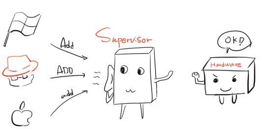
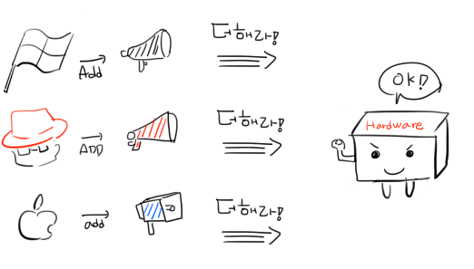
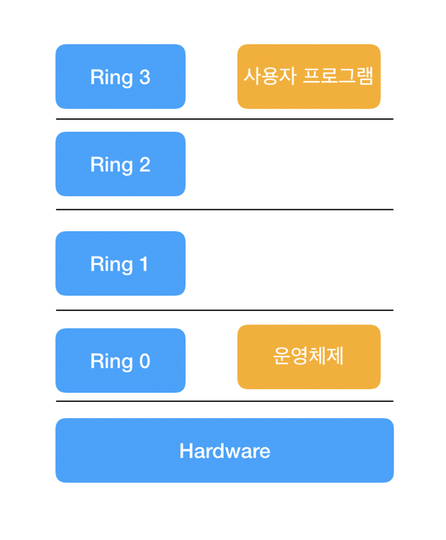
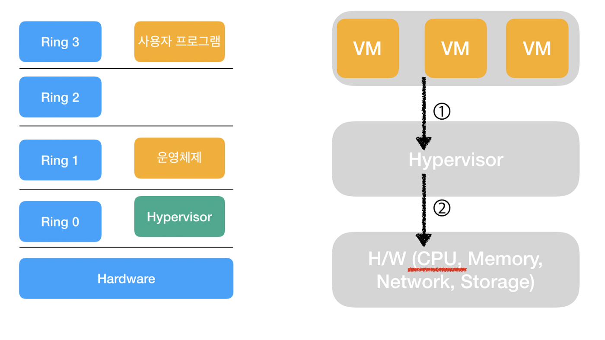
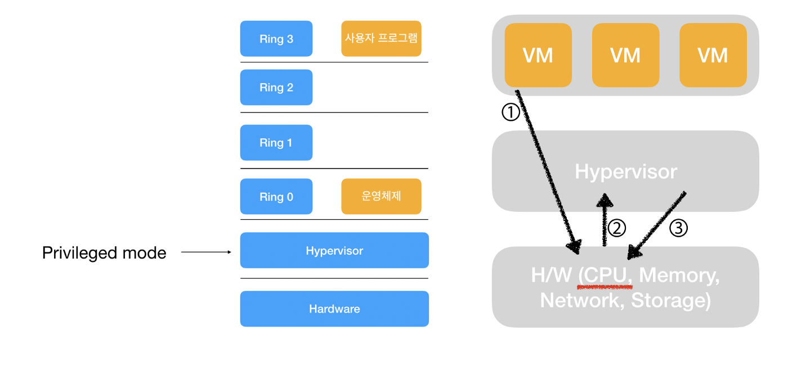
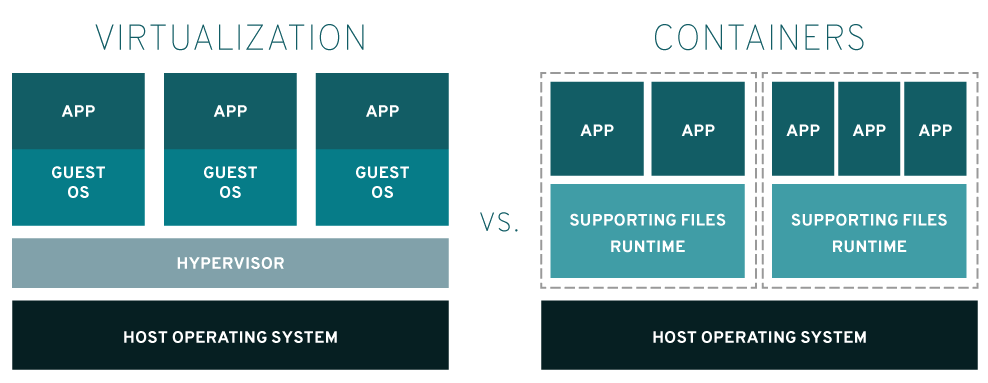

# 가상머신

- 하드웨어를 소프트웨어적으로 구현해서 그 위에서 운영체제가 작동하도록하는 기술

## 가상머신을 사용하는 이유

- 다른 운영체제를 사용해야 하는 경우(맥OS에서 윈도우, 윈도우에서 리눅스)
- 독립된 작업공간이 필요한 경우 (바이러스 회피, 백업)
- 하나의 머신에서 여러명에게 운영체제 환경을 제공
- 하나의 컴퓨터 자원을 여러 사용자에게 나누어 주는 상황에서 상호 간섭을 없애고 싶을 때

## 하이퍼바이저(Hypervisor)

- 가상 머신(Virtual Machine, VM)을 생성하고 구동하는 소프트웨어
- 위치와 역할에 따른 분류, 가상화 방식에 따른 분류가 있음

### 하이퍼바이저의 위치와 역할에 따른 분류

  

#### Type1: Native, Bare Metal 하이퍼바이저

- 하드웨어에 직접 설치하여 구동하는 형태
- 하드웨어를 제어하는 OS 역할과 VM 들을 관리하는 역할을 모두 하이퍼바이저가 담당
- 하이퍼바이저가 하드웨어 드라이버를 모두설정해야 하여 설치가 어려움
- 대규모로 관리되는곳에서 주로 사용: 엔터프라이즈 데이터 센터, 서버 기반 환경, 클라우드
- Type 1 제품: Xen, KVM, Microsoft Hyper-V, VMware vSphere

#### Type2: Hosted 하이퍼바이저

- Application 과 마찬가지로 OS 위에 설치되는 방식의 하이퍼바이저
- 컴퓨터 환경(OS)을 그대로 사용하는 방식이므로 설치 및 구성이 편리하다는 장점
- Type1 에 비하여 실행되는 OS의 layer가 많은것을 알수 있다. layer를 더 타야하므로 type1에 비하여 성능 떨어짐
- 개인 사용자가 컴퓨터에서 여러 개의 운영 체제를 구동하기 위해 주로 사용
- Type 2 제품: VMware, VirtualBox

### 하이퍼바이저의 가상화 방식에 따른 분류

- 운영체제별 사용하는 CPU명령어가 상이하여 CPU명령어를 가상화하는 방법에 따라 분류됨
- 과거의 분류 방식으로 현재VM제품은 다양한 기술을 사용하여 두가지 분류의 경계가 모호함

#### 전가상화(Full Virtualization)

  

- Hypervisor는 VM OS의 명령어를 하드웨어가 전달받을 수 있는 형태로 번역함.
- VM OS에게 하드웨어 자원을 분배하는 역할도 함.

#### 반가상화(Para Virtualization)

  

- VM OS가 직접 하드웨어에 명령어를 전달함.
- VM OS의 명령어(커널)를 수정.

- CPU 명령어를 가상화하는 범위에 따라 분류됨

#### 가상머신 없는 x86(인텔, AMD, arm제외) CPU

  

- Ring 번호가 낮을수록 높은 권한을 가짐
- 운영체제는 Ring 0에서 특권 명령(privileged mode)을 사용하여 필요한 컴퓨팅 자원에 접근이 가능

#### x86(인텔, AMD, arm제외) CPU에서 가상머신

- Vmware Binary translation

  - VM OS에서 전달받은 명령어를 Hypervisor에서 binary trasnlation란 기술을 통하여 일괄적인 하드웨어명령어로 변환하여 전달
  - VN OS의 명령어(커널)을 수정할 필요가 없음

- Xen Hypercall

  - Hypercall 기능을 사용하여 VM OS의 명령어가 하드웨어에 전달됨
  - VM OS의 명령어(커널)을 수정해야함
  - 성능과 속도가 우수하지만 VM OS가 오픈소스가 아닐경우 적용에 어려움이 있음

- CPU 차원의 가상화: Intel VT, AMD-V
  - VM OS에 관계없이 다양한 운영체제를 사용할 수 있다는 장점이 있음
  - CPU가 다시한번 하이퍼바이저에게 하드웨어 제어를 요구하기에 이에따른 오버헤드가 발생

## 가상머신 vs 컨테이너

  

- 컨테이너는 동일한 운영 체제 커널과 패키지 애플리케이션을 실행(runtime)환경과 공유하며 프로세스만 격리하는 방식
- 리눅스의 cgroups과 namespace를 을 통하여 작동하여 이러한 기능을 사용하지 않는 윈도우에서 구동이 어려움
  - cgroups: 프로세스들의 하드웨어 사용을 제한하고 격리시키는 리눅스 커널 기능.
- 컨테이너는 애플리케이션 코드, 런타임, 시스템 도구, 시스템 라이브러리 및 구성을 하나의 인스턴스에 패키징하는 기본적인 방법을 제공
- 작동시간 이 짧고 디스크도 VM에 비하여 적음
- 독립된 환경을 제공하지 않으며 보안에 취약함

## QnA

## References

> https://opentutorials.org/course/173

> http://cloudrain21.com/hypervisor-types

> https://www.slideshare.net/rkawkxms/docker-container

> https://inpages.tistory.com/86

> https://www.redhat.com/ko/topics/virtualization/what-is-a-hypervisor

> http://bugsfixed.blogspot.com/2016/10/blog-post.html#full-virtualization-vs-para-virtualzation

> https://medium.com/@ch.lee2/%ED%81%B4%EB%9D%BC%EC%9A%B0%EB%93%9C-%EC%9D%B4%ED%95%B4%ED%95%98%EA%B8%B0-3-%EC%A0%84%EA%B0%80%EC%83%81%ED%99%94%EC%99%80-%EB%B0%98%EA%B0%80%EC%83%81%ED%99%94-6f00b1f5e741

> https://m.blog.naver.com/PostView.nhn?blogId=alice_k106&logNo=220218878967&proxyReferer=https:%2F%2Fwww.google.com%2F

> https://born-dev.tistory.com/39

> https://www.redhat.com/ko/topics/containers/what-is-docker
