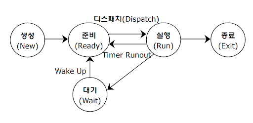

# 프로세스와 쓰레드

프로세스와 쓰레드를 정확히 이해해야 멀티 쓰레드 환경에서 왜 상태값을 갖도록 설계하면 안되는지에 대해 알 수 있다.

특히 `프로세스의 메모리 영역(Stack, Heap, Data, Text)`에 대한 이해가 중요하다.

- 프로세스 메모리 영역
    - `Stack` : 매개변수, 지역변수 등 임시적인 자료
    - `Heap` : 동적으로 할당되는 메모리
    - `Data` : 전역 변수
    - `Text` : Program 의 코드

프로세스는 운영체제에서 여러개가 존재하며 동작한다

## Multi Process

- 두 개 이상의 다수의 프로세서가 협력적으로 하나 이상의 작업을 동시에 처리하는 것이다
- 프로세스는 실행될 때마다 각각에 고유한 메모리 영역을 할당해주어야 하기 때문에 프로세스가 많아질수록 더 많은 메모리 공간을 차지하게 된다

### 장점

- 독립된 구조로 안전성이 높다
- 프로세스 중 하나에 문제가 생겨도 다른 프로세스에 영향을 주지 않는다

### 단점

- 독립된 메모리 영역을 가지고 있기 때문에 `Context Swithching` 을 위한 오버헤드가 발생한다

## Multi Thread

한 프로세스에서 여러 개의 쓰레드를 동시에 수행하는 것이다

멀티 쓰레드를 적용한 어플리케이션의 예시

- 웹 서버 프로세스는 클라이언트 요청이 들어오면 그 요청을 처리하기 위한 별도의 쓰레드를 생성한다
- 워드 프로세서는 사용자의 키 입력에 응답하기 위한 쓰레드, 백그라운드에서 맞춤법 및 문법 검사를 수행하기 위한 쓰레드를 가질 수 있다

### 장점

- 응답성이 좋아진다. 단일 쓰레드를 사용하면 그 작업이 완료될 때 까지 응답을 기다려야 한다. 멀티 쓰레드를 사용함으로서 응답성을 향상시킬 수 있다
- 자원을 공유할 수 있다. 쓰레드는 기본적으로 자신이 속한 프로세스의 자원을 공유하기 때문에 동일한 주소 공간 내에서 여러 쓰레드를 가질 수 있다

### 단점

- 쓰레드는 프로세스 내 자원을 공유하기 때문에 쓰레드 하나에서 오류가 발생하면 같은 프로세스 내의 모든 쓰레드가 종료될 수 있다
- 공유 자원에 대한 동기화 문제를 고려해야 한다

## Context Switching

`Context Switching` 은 하나의 프로세스가 CPU를 사용중인 상태에서 다른 프로세스가 CPU를 사용 하기 위해, 이전의 프로세스의 상태를 보관하고 새로운 프로세스의 상태를 적재하는 작업을 말한다

한 프로세스의 문맥은 그 프로세스의 `PCB(프로세스 제어 블록)` 에 기록되어 있다

프로세스가 증가하게 되면 문맥 교환이 많아져서 오버헤드가 증가하므로 시스템 성능에 악영향을 끼칠 수 있다.

`오버헤드` 란 CPU가 메모리에 적재하는 동안 아무것도 안하게 되는 현상을 의미한다

### 오버헤드의 해결 방안

- 문맥 교환이 자주 발생하지 않도록 다중 프로그래밍의 정도를 낮춘다
- 쓰레드를 이용하여 문맥 교환 부하를 최소화 시킨다

따라서, 이러한 멀티 프로세스의 단점 때문에 `멀티 쓰레드 환경` 을 선호하는 것이다

## PCB

특정 프로세스에 대한 정보를 담고 있는 운영체제의 자료구조이다. 작업을 진행하다가 프로세스의 전환이 발생하면 하던 일을 저장하고 CPU를 반환해야 한다. 그리고 나중에 스케줄링에 의해 재실행되었을 때 이전의 작업
정보를 알아야 한다. 그 정보가 담긴 공간이 `PCB` 이다. 프로세스의 생성과 동시에 그 프로세스의 고유한 `PCB` 도 같이 생성된다.

### 프로세스 제어 블록에 저장되는 정보

- 프로세스 식별자(PID)
- 프로세스 상태
    - new, ready, running, waiting, terminated
- 프로그램 카운터
    - 프로세스가 다음에 실행할 명령어의 주소를 가리킴
- CPU 레지스터
- CPU 스케줄링 정보
    - 프로세스 우선순위, 최종 실행 시각, CPU 점유시간 등
- 메모리 관리 정보
- 계정 정보
- 입출력 상태 정보

## 프로세스 상태 전이

프로세스 상태전이는 프로세스가 시스템 내에 존재하는 동안 프로세스의 상태가 변하는 것을 의미한다.

### 프로세스 상태

- 생성(Create)
    - 사용자에 의해 프로세스가 생성된 상태
- 준비(Ready)
    - CPU를 할당받을 수 있는 상태
- 실행(Running)
    - 프로세스가 CPU를 할당받아 동작중인 상태
- 대기(Waiting)
    - 프로세스 실행 중 입출력 처리 등으로 인해 CPU를 양도하고 입출력 처리가 완료되기 까지 대기 리스트에서 기다리는 상태
- 완료(Complete)
    - 프로세스가 CPU를 할당받아 수행을 종료한 상태

### 프로세스 상태 전이

#### new -> ready

new 상태에서 프로세스가 생성되면 OS 커널에 존재하는 Ready Queue 에 올라가게 된다

#### Dispatch (준비 -> 실행)

프로세스 스케줄러에 의해 결정된 우선순위에 따라 프로세스가 CPU를 점유하게 되는 상태

#### Timeout (실행 -> 준비)

프로세스가 실행중이다가 제한된 시간을 다 소비하여 CPU 점유를 빼앗기는 상태

#### Wakeup (대기 -> 준비)

프로세스가 자원을 할당받는 상태

## Interrupt

인터럽트란 CPU가 특정 기능을 수행하는 도중 급하게 다른 일을 처리하고자 할 때 사용할 수 있는 기능이다

### 인터럽트 과정

1. 프로세스 A 가 실행중 -> 갑자기 저장을 위한 로직이 실행
2. 현재 CPU가 처리하고 있던 일의 진행상황을 저장한다
3. 인터럽트 코드의 실행을 위해 CPU에 기존에 할당되어 있던 작업과 인터럽트 처리 될 작업을 교환한다
4. CPU에서 교환된 인터럽트 코드의 처리를 마친다
5. 이전 작업을 CPU에 다시 할당한다
6. 이전에 중단되었던 곳부터 다시 진행한다

3번에 해당하는 과정이 `Context Swiching` 이다.

## Q&A

- Context Swiching 보관되는 장소, 보관되는 이유

## 출처

https://www.youtube.com/watch?v=QmtYKZC0lMU&t=1121s
https://github.com/NKLCWDT/cs/blob/main/Operating%20System/%ED%94%84%EB%A1%9C%EC%84%B8%EC%8A%A4%EC%99%80%20%EC%93%B0%EB%A0%88%EB%93%9C.md
https://github.com/Seogeurim/CS-study/tree/main/contents/operating-system#%ED%94%84%EB%A1%9C%EC%84%B8%EC%8A%A4%EC%99%80-%EC%8A%A4%EB%A0%88%EB%93%9C

